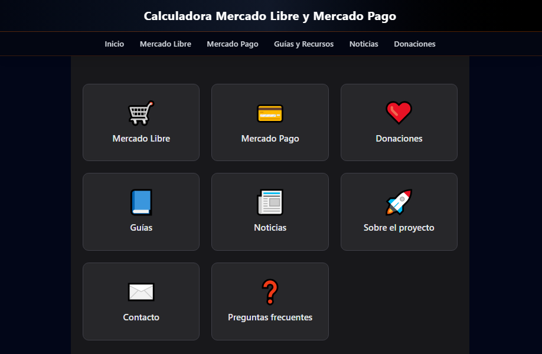
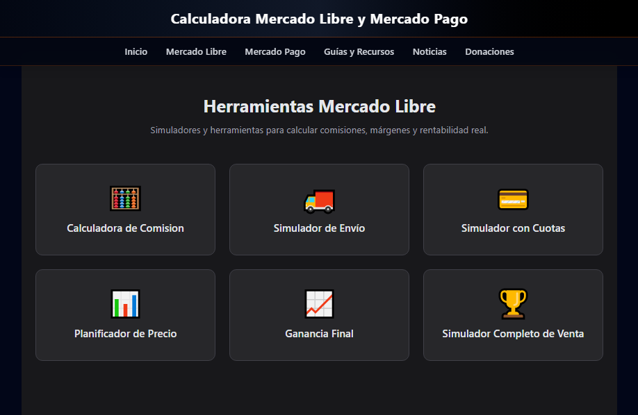
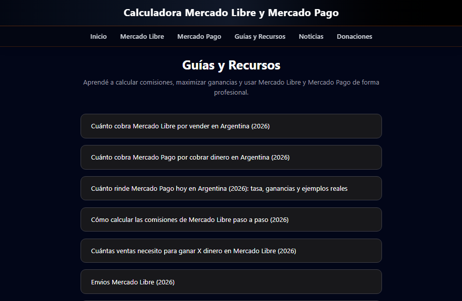
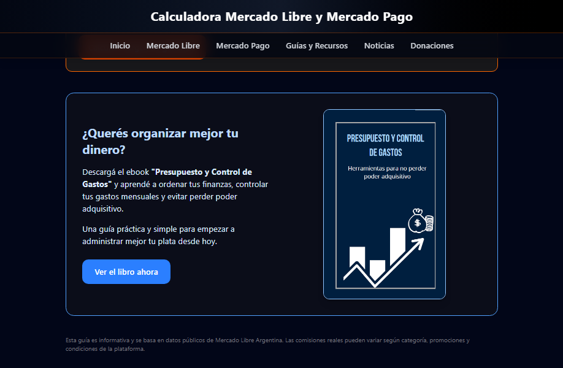
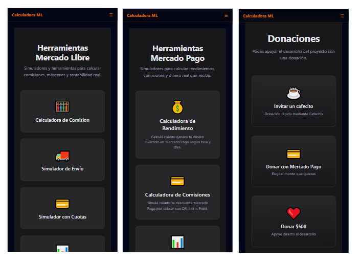

# Calculadora Mercado Libre & Mercado Pago

A modern web application that helps Mercado Libre sellers and Mercado Pago users calculate commissions, profitability, shipping costs and financial returns through an intuitive interface.

Besides offering calculation tools, the project also includes educational resources, news, SEO optimization and donation integrations, making it a complete platform for entrepreneurs and online sellers.

---

# 🚀 Live Demo

https://calculadora-mercadolibre.netlify.app/

---

# ✨ Features

## Mercado Libre Tools

- Commission Calculator
- Shipping Cost Simulator
- Installment Payment Simulator
- Price Planner
- Profit Calculator
- Complete Sales Simulator

## Mercado Pago Tools

- Investment Return Calculator
- Collection Fee Calculator

## Educational Resources

- Financial guides
- Educational articles
- Frequently Asked Questions (FAQ)
- News section with automated feed

## Additional Features

- Responsive design
- Mobile navigation menu
- Google Analytics integration
- Google Search Console
- SEO optimization
- Donation page
- Cafecito integration
- Mercado Pago donations
- Digital ebook promotion

---

# 📸 Screenshots

## Home



---

## Mercado Libre Tools



---

## Commission Calculator


---

## News Feed


---

## Guides & Resources



---

## Frequently Asked Questions


---

## Digital Book Promotion



---

## Mobile Version



---

# 🛠️ Tech Stack

### Frontend

- React
- Vite
- JavaScript
- React Router
- Tailwind CSS

### Development

- ESLint
- PostCSS
- npm

### Deployment

- Netlify

### Integrations

- Google Analytics
- Google Search Console
- RSS News Feed
- Cafecito
- Mercado Pago Checkout

---

# 📈 SEO

This project was developed with search engine optimization in mind.

Current implementation includes:

- Semantic HTML
- Optimized metadata
- Open Graph tags
- Robots.txt
- Sitemap
- Responsive design
- Fast loading with Vite
- Google Analytics
- Google Search Console

---

# 🎯 Project Goals

The objective of this project is to provide a free toolkit for Mercado Libre sellers and Mercado Pago users.

It also serves as an experiment in combining:

- Utility tools
- Educational content
- SEO
- Organic traffic
- Monetization
- Modern frontend development

---

# 📂 Project Structure

```
src/
 ├── components/
 ├── pages/
 ├── hooks/
 ├── utils/
 ├── services/
 └── assets/

public/
 ├── images/
 ├── icons/
 └── sitemap.xml
```

---

# ⚙️ Installation

Clone the repository

```bash
git clone https://github.com/stkener/calculadoramlmp.git
```

Go to the project folder

```bash
cd calculadoramlmp
```

Install dependencies

```bash
npm install
```

Run the development server

```bash
npm run dev
```

Build for production

```bash
npm run build
```

---

# 💡 Future Improvements

- Additional Mercado Libre calculators
- More educational articles
- Advanced financial simulators
- User accounts
- Favorites system
- Calculator history
- Progressive Web App (PWA)
- Dark/Light theme

---

# 👨‍💻 Author

**Sebastián Kener**

Technical University Programmer | Junior Software Developer

🌐 Portfolio  
https://stkener.github.io/portfolio_sebastian/

💼 LinkedIn  
https://linkedin.com/in/sebastiankener

💻 GitHub  
https://github.com/stkener

---

# 📄 License

This project is licensed under the MIT License.
